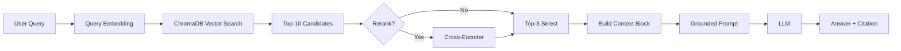

# Architecture — RAG Pipeline (Day 08 Lab)

> Template: Điền vào các mục này khi hoàn thành từng sprint.
> Deliverable của Documentation Owner.

## 1. Tổng quan kiến trúc

```
[Raw Docs]
    ↓
[index.py: Preprocess → Chunk → Embed → Store]
    ↓
[ChromaDB Vector Store]
    ↓
[rag_answer.py: Query → Retrieve → Rerank → Generate]
    ↓
[Grounded Answer + Citation]
```

**Mô tả ngắn gọn:**
Hệ thống RAG (Retrieval-Augmented Generation) được thiết kế để hỗ trợ tra cứu thông tin nội bộ của công ty (Chính sách hoàn tiền, SLA, Quy trình IT, Nội quy nhân sự). Hệ thống giúp nhân viên tìm kiếm câu trả lời nhanh chóng, chính xác và có nguồn trích dẫn (citation) rõ ràng, giảm tải cho các bộ phận hỗ trợ.


---

## 2. Indexing Pipeline (Sprint 1)

### Tài liệu được index
| File | Nguồn | Department | Số chunk |
|------|-------|-----------|---------|
| `policy_refund_v4.txt` | policy/refund-v4.pdf | CS | Tùy biến |
| `sla_p1_2026.txt` | support/sla-p1-2026.pdf | IT | Tùy biến |
| `access_control_sop.txt` | it/access-control-sop.md | IT Security | Tùy biến |
| `it_helpdesk_faq.txt` | support/helpdesk-faq.md | IT | Tùy biến |
| `hr_leave_policy.txt` | hr/leave-policy-2026.pdf | HR | Tùy biến |

### Quyết định chunking
| Tham số | Giá trị | Lý do |
|---------|---------|-------|
| Chunk size | 400 tokens | Cân bằng giữa việc giữ đủ ngữ cảnh và tối ưu chi phí LLM (ước lượng 1 token ≈ 4 ký tự). |
| Overlap | 80 tokens | Đảm bảo tính liên kết giữa các đoạn văn bản khi bị cắt. |
| Chunking strategy | Heading + Paragraph based | Tách theo Section Heading (`===`) và xuống dòng đôi (`\n\n`) để giữ nguyên cấu trúc logic. |
| Metadata fields | source, section, effective_date, department, access | Phục vụ filter, freshness, citation và phân loại theo phòng ban. |

### Embedding model
- **Model**: `paraphrase-multilingual-MiniLM-L12-v2` (Sentence Transformers - Local)
- **Vector store**: ChromaDB (PersistentClient)
- **Similarity metric**: Cosine Similarity (được cấu hình qua `hnsw:space`)

---

## 3. Retrieval Pipeline (Sprint 2 + 3)

### Baseline (Sprint 2)
| Tham số | Giá trị |
|---------|---------|
| Strategy | Dense (embedding similarity) |
| Top-k search | 10 |
| Top-k select | 3 |
| Rerank | Không |

### Variant (Sprint 3)
| Tham số | Giá trị | Thay đổi so với baseline |
|---------|---------|------------------------|
| Strategy | Hybrid (Dense + BM25) | Kết hợp vector search và keyword search (RRF) |
| Top-k search | 10 | Giữ nguyên để so sánh công bằng |
| Top-k select | 3 | Giữ nguyên (top-3 là điểm cân bằng giữa context và noise) |
| Rerank | Có (Cross-Encoder) | Dùng model `ms-marco-MiniLM-L-6-v2` để chấm lại điểm |
| Query transform | Không | Chưa triển khai (để dành cho Sprint 4 hoặc mở rộng) |

**Lý do chọn variant này:**
- **Hybrid (RRF)**: Giúp bắt được các từ khóa chuyên ngành, mã lỗi (ví dụ: `ERR-403`, `P1`, `SLA`) mà Dense retrieval đôi khi bỏ lỡ do xu hướng tìm theo nghĩa xấp xỉ.
- **Rerank**: Sau khi lấy 10 candidate tiềm năng, Cross-Encoder giúp đánh giá sự liên quan thực sự giữa Query và Chunk sâu hơn, đảm bảo 3 chunk đưa vào prompt là chất lượng nhất.

---

## 4. Generation (Sprint 2)

### Grounded Prompt Template
```
Answer only from the retrieved context below.
If the context is insufficient to answer the question, say you do not know and do not make up information.
Cite the source field (in brackets like [1]) when possible.
Keep your answer short, clear, and factual.
Respond in the same language as the question.

Question: {query}

Context:
{context_block}

Answer:
```

### LLM Configuration
| Tham số | Giá trị |
|---------|---------|
| Model | `gpt-4o-mini` (hoặc cấu hình trong `.env`) |
| Temperature | 0 (để đảm bảo tính ổn định và tính trung thực của câu trả lời) |
| Max tokens | 512 |

---

## 5. Failure Mode Checklist

> Dùng khi debug — kiểm tra lần lượt: index → retrieval → generation

| Failure Mode | Triệu chứng | Cách kiểm tra |
|-------------|-------------|---------------|
| Index lỗi | Retrieve về docs cũ / sai version | `inspect_metadata_coverage()` trong index.py |
| Chunking tệ | Chunk cắt giữa điều khoản | `list_chunks()` và đọc text preview |
| Retrieval lỗi | Không tìm được expected source | `score_context_recall()` trong eval.py |
| Generation lỗi | Answer không grounded / bịa | `score_faithfulness()` trong eval.py |
| Token overload | Context quá dài → lost in the middle | Kiểm tra độ dài context_block |

---

## 6. Diagram (tùy chọn)

> TODO: Vẽ sơ đồ pipeline nếu có thời gian. Có thể dùng Mermaid hoặc drawio.


